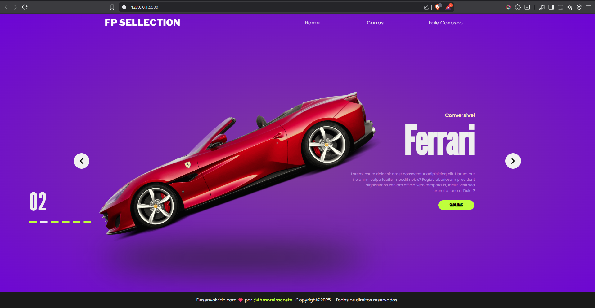

# 🚗 FP Sellection App

Um aplicativo web moderno para exibir carros de forma interativa e estilizada.  
O usuário pode navegar entre diferentes modelos e visualizar **nome, subtítulo, descrição e imagem** de cada carro.

---

## ✨ Funcionalidades
- 🔄 Navegação entre os carros com animação suave.  
- 🖼️ Exibição de **imagem, título, subtítulo e descrição** de cada modelo.  
- 🎨 Layout responsivo e minimalista.  
- 📱 Compatível com dispositivos móveis.  

---

## 🛠️ Tecnologias Utilizadas
- **HTML5**  
- **CSS3** (com animações e keyframes)  
- **JavaScript (ES6+)**  

---

## 📂 Estrutura de Pastas
```bash
📦 fp-app
 ┣ 📂 data
 ┃ ┗ 📜 data.js        # Dados dos carros
 ┣ 📂 assets
 ┃ ┗ 🖼️ imagens        # Imagens dos carros
 ┣ 📂 css
 ┃ ┗ 📜 style.css      # Estilos e animações
 ┣ 📂 js
 ┃ ┗ 📜 script.js      # Lógica do app
 ┣ 📜 index.html       # Página principal
 ┗ 📜 README.md        # Documentação do projeto


## 🚀 Como Usar

1. Clone este repositório:
   ```bash
   git clone https://github.com/thmoreiracosta/fit-app.git

## Preview


## 📌 Melhorias Futuras

 - Adicionar transições mais suaves entre os carros
 - Implementar busca por modelo
 - Criar versão em React para maior escalabilidade
 - Integrar com API real de catálogo de carros

